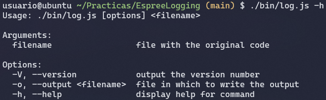
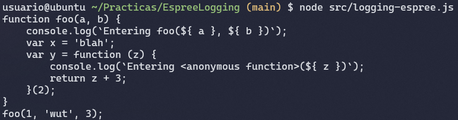
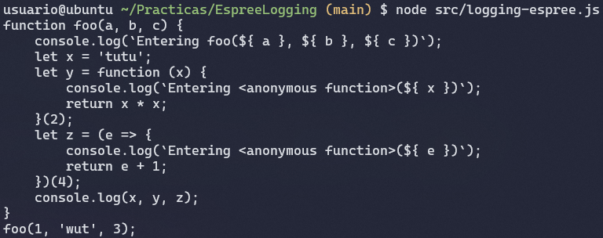
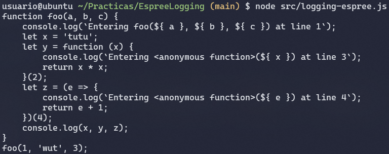
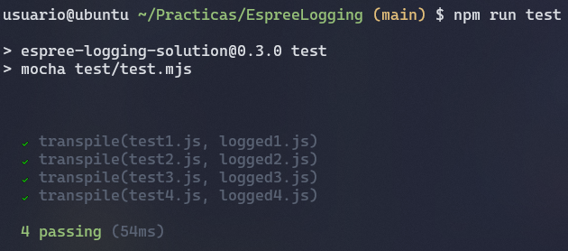
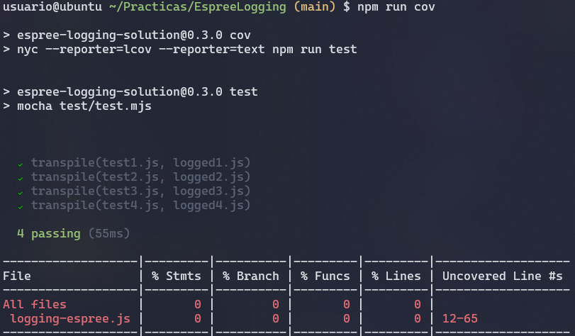
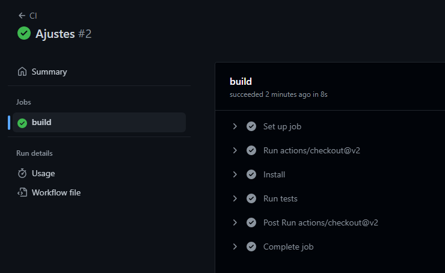
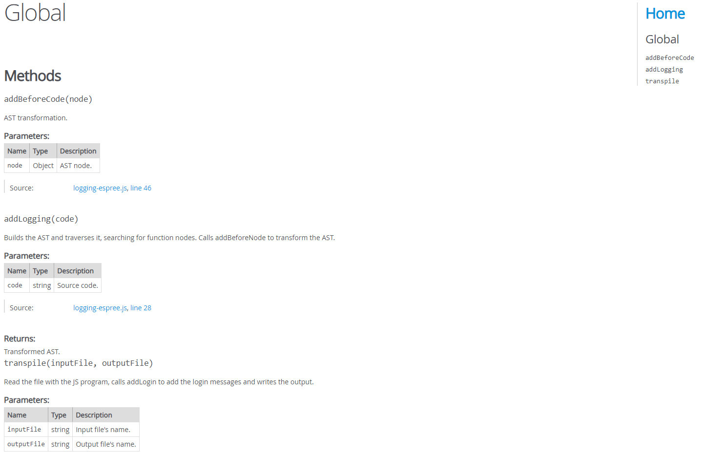

[](https://classroom.github.com/open-in-codespaces?assignment_repo_id=10311247)

# Assignment: Espree Logging

In this assignment, we must have done the following main objectives:
* Show the function's name each time we enter a function.
* Show the function's parameters each time we enter a function.
* Show the line where the function was initialized.

These steps will be executed each time the program encounters a **Function Declaration**, **Function Expression** or **Arrow Function**.

The `logging-espree.js` code was modified in order to show all the values I said previously: 
Example:

```javascript
function foo(a, b) {
    var x = 'blah';
    var y = (function (z) {
        return z + 3;
    })(2);
}

foo(1, 'wut', 3);
```

```javascript
function foo(a, b) {
    console.log(`Entering foo(${ a }, ${ b }) at line 1.`);
    var x = 'blah';
    var y = function (z) {
        console.log(`Entering <anonymous function>(${ z }) at line 3.`);
        return z + 3;
    }(2);
}

foo(1, 'wut', 3);
```

## Task 1: CLI with [Commander.js](https://www.npmjs.com/package/commander).

For the first task, as usual, I created a **CLI** with *Commmander*. The code was almost complete, but I added a name to the program.
The result is the following one:



The name is in the *Usage* section. It's default value is *log*, but I changed it to *./bin/log.js*.

## Task 2: Scripts in *package.json* and imported modules.

The first thing was to add some dependencies in order to work with tests, make better documentation reports and use code coverage. The following lines represent the dependencies I added:

```javascript
"chai": "^4.3.6",
"nyc": "^15.1.0",
"jsdoc": "^4.0.2"
```

Also, I added a couple of scripts to the *package.json* file, so I can carry on some tasks a little easier. 

```javascript
"scripts": {
    "log": "./bin/log.js -h",
    "test": "mocha",
    "cov": "nyc --reporter=lcov --reporter=text npm run test",
    "doc": "jsdoc ./src"
},
```

## Task 3: Add function and parameters names.

To fulfill this task, I needed to complete the following functions:
* *addLogging(code)*: Allows to build the AST and traverses it. It's main objective is to call the *addBeforeCode(node)* function in order to modify the **AST**, only in the required functions. It is important to say that the *ecmaVersion* in the first line is necessary if we want to work with backticks (``). This occurs because **Espree** does not support them in old versions.

    ```javascript
    export function addLogging(code) {
        let ast = espree.parse(code, {ecmaVersion: 12});
        estraverse.traverse(ast, {
        enter: function(node, parent) {
            if (node.type === 'FunctionDeclaration' ||
                node.type === 'FunctionExpression') {
                addBeforeCode(node);
            }
        }
        });
        return escodegen.generate(ast);
    }
    ```

* *addBeforeCode(node)*: Allows to modify the **AST**, inserting code in it. All I had to do was to take the name of the function and it's arguments. With that, I created a string that has all the information.

    ```javascript
    function addBeforeCode(node) {
        let parameters = '';

        // Function name.
        let name = node.id ? node.id.name : '<anonymous function>';

        // Function parameters.
        if (node.params.length != 0) {
            parameters = node.params.map(param => ` \${ ${param.name} }`);
            parameters[0] = parameters[0].slice(1);
        }

        // Creating the code to insert.
        let beforeCode = `console.log(\`Entering ${name}(${parameters})\`);`;

        // Creating the new node.
        let beforeNodes = espree.parse(beforeCode, {ecmaVersion: 12}).body;

        // Adding the new node.
        node.body.body = beforeNodes.concat(node.body.body);
    }
    ```

If we run the code with the following function:

```javascript
function foo(a, b) {
    var x = 'blah';
    var y = (function (z) {
        return z + 3;
    })(2);
}
```

The result shows this, at this point:



## Task 4: Arrow functions supported.

This task is easily acomplished if we modify the *addLogging(code)* function. The only thing that is needed is to change the conditional clause, adding a new condition that supports **ArrowFunctionExpression**. With this, the task is completed.

```javascript
export function addLogging(code) {
    let ast = espree.parse(code, {ecmaVersion: 12});
    estraverse.traverse(ast, {
      enter: function(node, parent) {
        if (node.type === 'FunctionDeclaration' ||
            node.type === 'FunctionExpression' ||
            node.type === 'ArrowFunctionExpression') {
            addBeforeCode(node);
        }
      }
    });
    return escodegen.generate(ast);
}
```

If we try this modified function with the following code (contains an arrow function):

```javascript
function foo(a, b, c) {
    let x = 'tutu';
    let y = (function (x) { return x * x })(2);
    let z = (e => { return e + 1 })(4);
    console.log(x,y,z);
}
```

The result shows that the arrow function assigned to *let z* is visited, showing that it's name is anonymous and it's "e" parameter:



## Task 5: Add line number.

In order to show the line number, we must modify our two functions. This happens because the following reasons:
* In the *addLogging(code)* function, when we parse the code, we must add an option that allows the resultant **AST** to have the location information. This means that, aside from other information, the **AST** will have the lines where all the nodes are located inside the code.

    ```javascript
    export function addLogging(code) {
        let ast = espree.parse(code, {ecmaVersion: 12, loc: true});
        estraverse.traverse(ast, {
        enter: function(node, parent) {
            if (node.type === 'FunctionDeclaration' ||
                node.type === 'FunctionExpression' ||
                node.type === 'ArrowFunctionExpression') {
                addBeforeCode(node);
            }
        }
        });
        return escodegen.generate(ast);
    }
    ```

* In the *addBeforeCode(node)* function, we need to extract the location and add it to our modified code.

    ```javascript
    function addBeforeCode(node) {
        let parameters = '';

        // Function name.
        let name = node.id ? node.id.name : '<anonymous function>';

        // Function parameters.
        if (node.params.length != 0) {
            parameters = node.params.map(param => ` \${ ${param.name} }`);
            parameters[0] = parameters[0].slice(1);
        }

        // Creating the code to insert.
        let beforeCode = `console.log(\`Entering ${name}(${parameters}) at line ${node.loc.start.line}\`);`;

        // Creating the new node.
        let beforeNodes = espree.parse(beforeCode, {ecmaVersion: 12}).body;

        // Adding the new node.
        node.body.body = beforeNodes.concat(node.body.body);
    }
    ```

Once all the changes are done, if we try the functions with the arrow function code we tried in the previous task, the result is:



## Task 6: Testing.

In this task, we must use Mocha in order to execute a set of tests to make sure the code is working fine.
The tests are separated in some files:
* **Input files**: They are located in the *test/data/inputs* folder and their content is a **JS** code.

    ```javascript
    function foo(a, b) {   
        var x = 'blah';   
        var y = (function () {
            return 3;
        })();
    }     
    foo(1, 'wut', 3);
    ```

* **Expected files**: They are located in the *test/data/expected* folder and their content is a **JS** code, which must be the resultant code when we apply the transformations. This is, each time it enters a function, it must be able to write the *console.log* with it's information.

    ```javascript
    function foo(a, b) {
        console.log(`Entering foo(${ a }, ${ b }) at line 1`);
        var x = 'blah';
        var y = function () {
            console.log(`Entering <anonymous function>() at line 3`);
            return 3;
        }();
    }
    foo(1, 'wut', 3);
    ```

* **Result files**: They are located in the *test/data/results* folder and their content is the expected execution of the generated **JS** code.

    ```javascript
    Entering foo(1, wut) at line 1
    Entering <anonymous function>() at line 3
    ```

* **Output files**: They are located in the *test/data/outputs* folder and their content is the execution of the generated **JS** code. Their content is deleted when the tests pass successfully.

    ```javascript
    Entering foo(1, wut) at line 1
    Entering <anonymous function>() at line 3
    ```

Also, we need a file where our tests will be described (*test/test-description.mjs*) and a file where our tests will be executed (*test/test.mjs*).

* **Test description file**: In this file, I defined each test as an object with it's files.

    ```javascript
    export default [
    {
        input: 'test1.js',
        output: 'logged1.js',
        correctLogged: 'correct-logged1.js',
        correctOut: 'logged-out1.txt'
    },
    {
        input: 'test2.js',
        output: 'logged2.js',
        correctLogged: 'correct-logged2.js',
        correctOut: 'logged-out2.txt'
    },
    {
        input: 'test3.js',
        output: 'logged3.js',
        correctLogged: 'correct-logged3.js',
        correctOut: 'logged-out3.txt'
    },
    {
        input: 'test4.js',
        output: 'logged4.js',
        correctLogged: 'correct-logged4.js',
        correctOut: 'logged-out4.txt'
    }
    ]
    ```

* **Test execution file**: In this file, the tests will be executed with a *for* loop that will iterate through the test description array.

    ```javascript
    import { transpile } from "../src/logging-espree.js";
    import assert from 'assert';
    import * as fs from "fs/promises";
    import { dirname } from 'path';
    import { fileURLToPath } from 'url';

    const __dirname = dirname(fileURLToPath(import.meta.url));
    import Tst from './test-description.mjs';

    const Test = Tst.map(t => ({
        input: __dirname + '/data/inputs/' + t.input,
        output: __dirname + '/data/outputs/' + t.output,
        correctLogged: __dirname + '/data/expected/' + t.correctLogged,
        correctOut: __dirname + '/data/results/' + t.correctOut,
    })
    )

    function removeSpaces(s) {
        return s.replace(/\s/g, '');
    }

    for (let i = 0; i < Test.length; i++) {
        it(`transpile(${Tst[i].input}, ${Tst[i].output})`, async () => {

            // Compile the input and check the output program is what expected
            await transpile(Test[i].input, Test[i].output);
            let output = await fs.readFile(Test[i].output, 'utf-8');
            let expected = await fs.readFile(Test[i].correctLogged, 'utf-8');
            assert.equal(removeSpaces(output), removeSpaces(expected));
            await fs.unlink(Test[i].output);

            // Run the output program and check the logged output is what expected
            let correctOut = await fs.readFile(Test[i].correctOut, 'utf-8');

            let oldLog = console.log; // mocking console.log
            let result = [];
            let resultantString;
            console.log = function (...s) {
                if (s.length > 1) {
                    let sString = s.join(' ');
                    s = [sString];
                }
                result.push(s);
                resultantString = result.join('\n');
            };
            eval(output);

            assert.equal(removeSpaces(resultantString), removeSpaces(correctOut));
            console.log = oldLog;
        });  
    }
    ```

With these steps, if we execute the tests, we might be able to see that they are passed successfully:



There's a problem with **asynchronous testing** that is making my tests to pass whenever they want.

## Task 7: Code Coverage.

I had problems when I generated the code coverage report. Even with a correct script in the *package.json* file, the coverage report shows 0 code coverage. This happenned even after adding some options to **Nyc** in order to include the code coverage specifically:

```javascript
"nyc": {
    "all": true,
    "include": [ "src/*.js" ]
},
```

I searched about this issue, and it seems that **Nyc** does not work with **ES6** modules anymore, so a solution may be using **CommonJS** modules in the whole project.



## Task 8: CI with GitHub Actions.

If we want to use Continuous Integration with GitHub Actions, the only thing I had to do was editing the *.github/workflows/nodejs.yml* file and fill it with the following lines:

```yml
# Write your workflow for CI here
name: CI

# Controls when the workflow will run
on:
  # Triggers the workflow on push or pull request events but only for the $default-branch branch
  push:
    branches: [ main ]
  pull_request:
    branches: [ main ]

  # Allows you to run this workflow manually from the Actions tab
  workflow_dispatch:

# A workflow run is made up of one or more jobs that can run sequentially or in parallel
jobs:
  # This workflow contains a single job called "build"
  build:
    # The type of runner that the job will run on
    runs-on: ubuntu-latest

    # Steps represent a sequence of tasks that will be executed as part of the job
    steps:
      # Checks-out your repository under $GITHUB_WORKSPACE, so your job can access it
      - uses: actions/checkout@v2

      - name: Install
        run: npm install

      - name: Run tests
        run: npm run test
```

When we make a push to the repo, we can see the continuous integration execution, with all the jobs and steps we defined:



## Task 9: Documentation with JSDoc.

If we want to create a documentation report with **JSDoc**, we must follow some steps:
* **Adding JSDoc script to the package.json**: We need to add a script that allows to generate the documentation report.

    ```javascript
    "doc": "jsdoc ./src/*js"
    ```
* **Adding JSDoc comments to the functions**: The **JSDoc** comments have the following structure:

    ```javascript
    /**
     * Read the file with the JS program, calls addLogin to add the login messages and writes the output.
     * @param {string} inputFile Input file's name.
     * @param {string} outputFile Output file's name.
     */
    export async function transpile(inputFile, outputFile) {
        let code = await fs.readFile(inputFile, 'utf8');
        code = addLogging(code);
        fs.writeFile(outputFile, code, err => {
        if (err) {
            console.error(err);
            return;
        }
        });
    }
    ```

If we run the script a documentation report will be generated in the */out* folder. If we open the *index.html* with **LiveServer** we can see the following page:



## Task 10: Publishing the module in NPM and GitHub.
